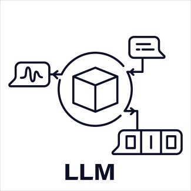
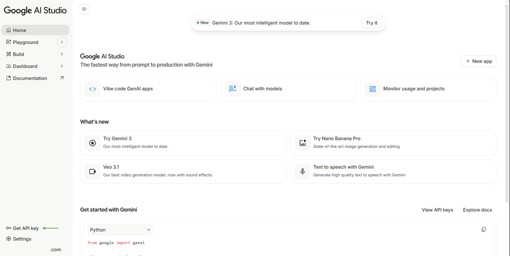
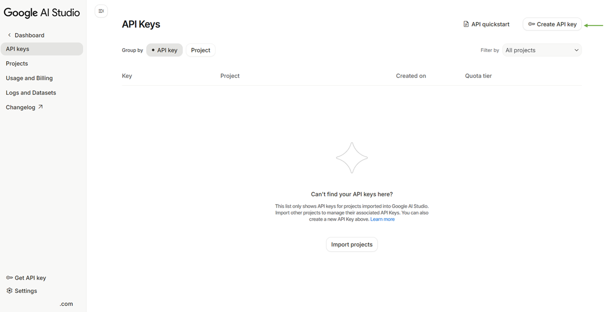
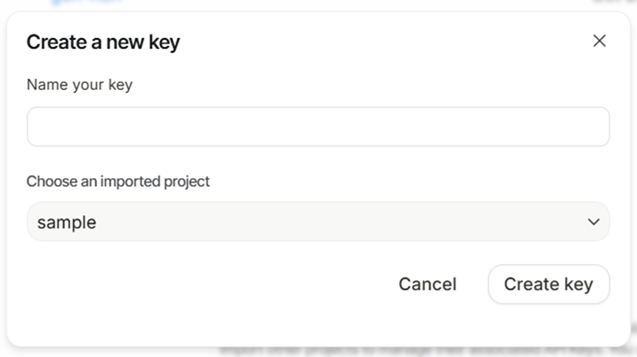

# Travel Planner Agent

<div align="justify">
This project creates a basic agentic Travel Planner that works with two agents in a user-in-loop setup. It uses a User Agent to collect travel needs and a Planner Agent to build and refine the trip plan. Both agents talk through a RoundRobinGroupChat flow, which keeps the conversation organized and predictable.
<br><br>
The goal is to make trip planning straightforward by letting the user guide the process while the planner improves the itinerary step by step. The system is easy to understand, modular, and suitable for extending into more detailed travel tools.
</div>


## Setup
<h3>
<div>
 <b>Environment</b>
</div>
</h3>

*Note - The app is written using Python virtual environment version **3.12.10** and supports the latest Python versions. However, lower Python versions may offer more stability compared to the latest ones. Below setup will focus Windows system. And commands to setup may vary for macOS or Linux.*
1. Move to folder (CLI commands)
```bash
# If you downloaded the file, just navigate to folder
# Then press Shift (in Windows) + Left Mouse click
# Choose Open PowerShell window here option and move on to creating virtual environment
cd travel_planner_agent
```

2. Create a python virtual environment using -
```bash
# Path to installation of particular version of python  may vary
# I have installed more than one version of python in pyver directory
# Refer the resources section, for youtube video to install multiple versions of python
C:\Users\<username>\pyver\py3121\python -m venv travplan
```

3. Activate the virtual environment using -
```bash
travplan/Scripts/activate
```

4. Install python packages using - 
```bash
pip install -r requirements.txt
```

<div>
<h3>
 <b>LLM Model</b>
</h3>
</div>


1. Create a `.env` environment file, which will hold the key of Gemini LLM Model to run the agentic system. 

2. To get the Gemini's API key, please continue reading below steps.

3. Login to your prefered <a href="https://accounts.google.com/">Google Account</a>

4. Navigate to <a href="https://aistudio.google.com/">Google AI Studio</a> website

5. Alternatively you can directly go to <a href="https://aistudio.google.com/">Google AI Studio</a> website and click on <i>Get Started</i> to <i>login in with desired account</i>.

6. Choose <i>Get API Key</i> option to view and get an API key, present in bottom left corner. 

<div align='center'>
 
</div>

7. Select <i>Create API key</i> option to create an API key, present in top right corner.

<div align='center'>
 
</div>

7. Give a name to api key for future reference (based on project). And create a project, which shall have rights of API key. 

<div align='center'>
 
</div>

8. We can create a project in <a href="https://console.cloud.google.com/projectcreate">Google's Cloud Console</a>, and access in Google AI Studio. But to keep things simple, we'll create project through the Google AI Studio's API portal.

9. Congratulations! You have successfully created a free Google's Gemini API key. Just copy it and paste it into your `.env` file.

Note - A <i>.env</i> file stores private settings, like secret keys or passwords, for an app. These are user-specific variables that the app reads to work correctly. Online services often block uploads of <i>.env</i> files to prevent accidents. If someone changes the info inside, it can break the app. Developers keep <i>.env</i> files local and never share them publicly, such as in code repositories.


## Execute
This section explains how to run the application, the folder structure involved, and the different features available once the app is running.

**Steps to run**

1. Run the app using below command (before running please activate the virtual environment)
```bash
python app.py
``` 

2. A message will pop-up in console or terminal as to enter your message. And you can run it until Gemini API key doesn't exhausts. 

Note - To track API usage, visit <a href="logs"> logs folder</a>, which holds the logs of agents and LLM usage.


## Resources
**Python Version Setup**
<ul>
<li>https://www.youtube.com/watch?v=28eLP22SMTA&t=99s</li>
</ul>

**Autogen**
<ul>
<li>https://microsoft.github.io/autogen/stable/user-guide/agentchat-user-guide/index.html</li>
<li>https://github.com/microsoft/autogen</li>
<li>https://microsoft.github.io/autogen/stable/user-guide/agentchat-user-guide/examples/index.html</li>
</ul>
